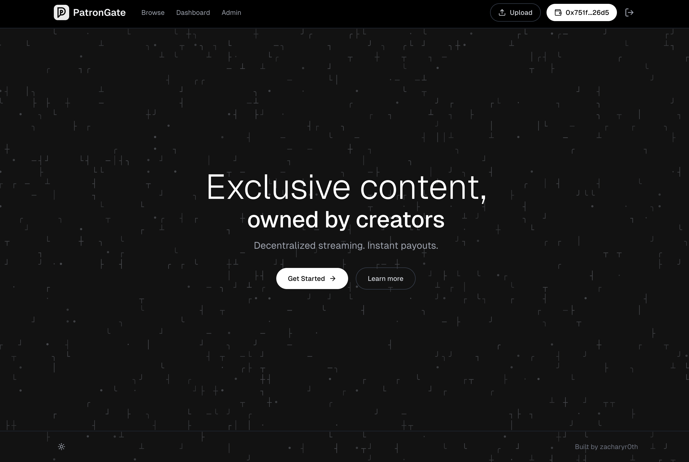

<p align="center">
  
</p>

# PatronGate

Membership and content monetization platform built on [Aptos](https://aptos.dev) with decentralized storage via [Shelby Protocol](https://shelby.dev).



## Overview

PatronGate enables creators to offer tiered memberships and gated content. Memberships are paid in [APT](https://aptos.dev/en/network/blockchain/aptos-white-paper#aptos-token) and content is stored on [Shelbynet](https://shelby.dev).

## Tech Stack

- **Frontend**: [Next.js 15](https://nextjs.org), React, [Tailwind CSS](https://tailwindcss.com)
- **Blockchain**: [Aptos](https://aptos.dev) (Move smart contracts)
- **Storage**: [Shelby Protocol](https://shelby.dev) on Shelbynet
- **Database**: [Neon Postgres](https://neon.tech) with [Drizzle ORM](https://orm.drizzle.team)
- **Monorepo**: [Turborepo](https://turbo.build) with [Bun](https://bun.sh)

## Project Structure

```
apps/
  web/              # Next.js frontend
contracts/          # Aptos Move smart contracts
packages/
  blockchain/       # Aptos SDK and React hooks
  database/         # Drizzle schema and migrations
  storage/          # Shelby upload service
  ui/               # Shared React components
```

## Requirements

- [Bun](https://bun.sh) >= 1.0.0
- Node.js >= 18
- [Aptos CLI](https://aptos.dev/tools/aptos-cli/) (for contract deployment)

## Setup

1. Clone and install dependencies:

```bash
git clone https://github.com/zacharyr0th/patron-gate.git
cd patron-gate
bun install
```

2. Configure environment variables:

```bash
cp .env.example .env
```

See [.env.example](.env.example) for all required values.

3. Start development server:

```bash
bun dev
```

The app runs at http://localhost:3001

## Smart Contract

The membership contract is deployed on Aptos testnet:

- **Address**: [`0xd6d6cd1e24213702d13504c50f4782aa1a83fc7c0c6c9417bac50a3d05d110bd`](https://explorer.aptoslabs.com/account/0xd6d6cd1e24213702d13504c50f4782aa1a83fc7c0c6c9417bac50a3d05d110bd?network=testnet)
- **Module**: `membership`

Contract commands:

```bash
bun run contract:compile    # Compile Move contracts
bun run contract:test       # Run contract tests
bun run contract:deploy     # Deploy to testnet
```

## Payments

- **Memberships**: Paid in [APT](https://aptos.dev/en/network/blockchain/aptos-white-paper#aptos-token) on Aptos testnet/mainnet
- **Storage**: Shelby uploads paid via [X402](https://www.x402.org) using APT on [Shelbynet](https://shelby.dev)

To use testnet, get test APT from the [Aptos Faucet](https://aptos.dev/en/network/faucet).

## Environment Variables

Key variables (see [.env.example](.env.example) for full list):

| Variable | Description | Source |
|----------|-------------|--------|
| `DATABASE_URL` | Postgres connection string | [Neon](https://neon.tech) |
| `NEXT_PUBLIC_MEMBERSHIP_CONTRACT_ADDRESS` | Deployed contract address | After contract deployment |
| `SHELBY_API_KEY` | Shelby Protocol API key | [geomi.dev](https://geomi.dev) |
| `MASTER_APTOS_PRIVATE_KEY` | Platform wallet for Shelby operations | Your Aptos wallet |
| `SHELBY_NETWORK` | Storage network (`SHELBYNET`) | - |

## Scripts

```bash
bun dev           # Start development server
bun build         # Build all packages
bun lint          # Lint codebase
bun typecheck     # Run TypeScript checks
bun clean         # Remove build artifacts
```

## License

[MIT](LICENSE)
